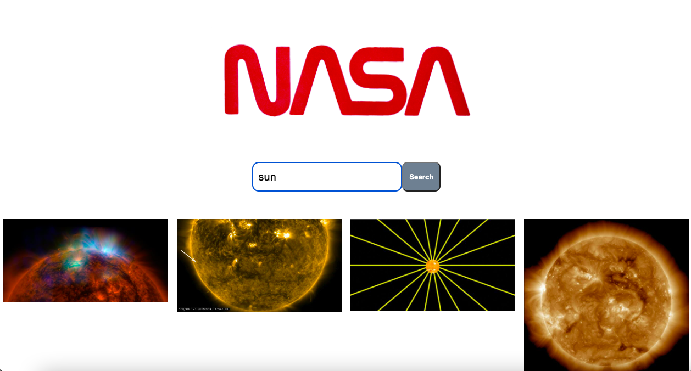

Nasa Search Engine Technical Test

UI:

An app that is designed to retrieve and display space-related images from a NASA API endpoint:

https://images-api.nasa.gov/searchq={searchInput}

Dependencies for this project are
React
Node.js
axios

Installation
Navigate to the desired directory in your terminal and run

https://github.com/JordsCodes/tech-test

Install Node Project Manager: npm install

Run appp by navigating to the project root directory and run: npm start

Notes
Given additional time, I would make the app be ble to load full resolution versions of the images on new pages, not just thumbnails.
